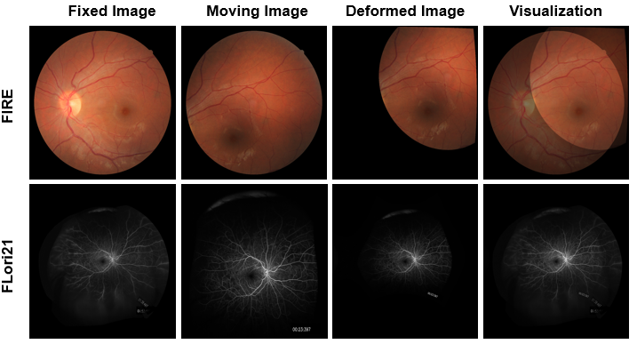

# RetinaRegNet
RetinaRegNet is a versatile registration model that achieves state-of-the-art performance in various retinal image registration problems. RetinaRegNet has the capacity to register images with large displacement deformation and minimal overlap. Unlike other deep learning-based registration methods, it does not require training on retinal images, making it a general approach applicable to other image registration problems. Our method is inspired by the paper titled ["Emergent Correspondence from Image Diffusion"](https://arxiv.org/abs/2306.03881), where the authors applied a latent stable diffusion model to generate robust Diffusion Features (DIFT) for finding semantic correspondences. We evaluated the performance of RetinaRegNet on three retinal image registration datasets: two public datasets, ["FIRE"](https://carlos.hernandez.im/papers/2017_07_JMO.pdf) and ["FLoRI21"](https://ieeexplore.ieee.org/document/9850360), and a privately owned dataset titled "LSFG".

<p align="center">
  
</p>

This GitHub repository includes the latest implementation of our paper titled **RetinaRegNet: A Zero-Shot Approach for Retinal Image Registration.** Please note that this paper is an updated version of our previous paper titled **RetinaRegNet: A Versatile Approach for Retinal Image Registration**. Since both papers belong to the same study, we are using a single GitHub repository for both.

For additional queries about the model and its architecture, kindly refer to our paper titled ["RetinaRegNet: A Zero-Shot Approach for Retinal Image Registration"](https://www.sciencedirect.com/science/article/pii/S001048252401730X).

## Requirements
The scripts were executed using a custom kernel configured with the list of packages mentioned below.
* torch==2.0.1
* torchvision==0.15.2
* jax==0.4.23
* jaxlib==0.4.23
* accelerate==0.23.0
* diffusers==0.20.2
* ipympl==0.9.3
* transformers==4.34.0
* xformers==0.0.22
* numpy
* scipy
* opencv-python
* matplotlib
* pyunpack
* **Note:** To install the aforementioned list of packages, kindly use the command `pip install -r requirements.txt`

## Datasets
* [Fundus Image Regsitration Dataset (FIRE)](https://projects.ics.forth.gr/cvrl/fire/)
* [Fluorescein Angiography Longitudinal Retinal Image Registration 2021 Dataset (FLoRI21)](https://ieee-dataport.org/open-access/flori21-fluorescein-angiography-longitudinal-retinal-image-registration-dataset)
* Laser Speckle Flowgraphy Dataset (LSFG) -- To be released soon
  
## Evaluation Steps
Evaluating our model on any of the mentioned datasets involves three simple steps, outlined below:
+ **Download a copy of the dataset using the provided link.**
+ **Download the corresponding script for the dataset from this repository.**
+ **Start executing the entire script with style.** 

**Note:**
+ Before starting the model evaluation, ensure that the dataset and its corresponding script are saved in the same directory.
+ The aforementioned scripts are customized for each dataset listed here, facilitating the automatic processing of all images and their corresponding ground truth landmarks.

## References
Certain code cells were from this [GitHub repository](https://github.com/Tsingularity/dift), as detailed in the paper titled ["Emergent Correspondence from Image Diffusion"](https://arxiv.org/abs/2306.03881).

## Citations
Kindly cite our paper as follows if you use our code.
```bibtex
@article{SIVARAMAN2025109645,
title = {RetinaRegNet: A zero-shot approach for retinal image registration},
journal = {Computers in Biology and Medicine},
volume = {186},
pages = {109645},
year = {2025},
issn = {0010-4825},
doi = {https://doi.org/10.1016/j.compbiomed.2024.109645},
url = {https://www.sciencedirect.com/science/article/pii/S001048252401730X}
}
```
## Contact
For any questions related to the code or its execution, please feel free to contact Vishal Balaji Sivaraman at vishalbalaji.sivaraman@medicine.ufl.edu.
